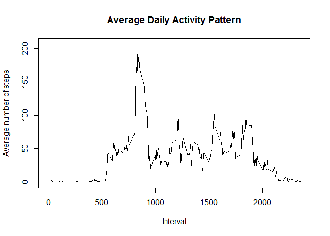
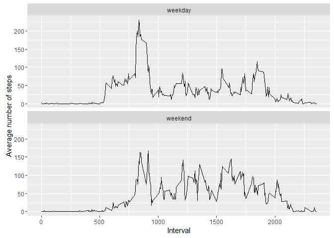

# Reproducible Research: Peer Assessment 1


## 1. Loading and preprocessing the data

```r
activity <- read.csv("activity.csv", header = TRUE, na.strings = "NA", stringsAsFactors = FALSE)
activity$date <- as.Date(activity$date, "%Y-%m-%d")
```

## Histogram of the total number of steps taken each day

```r
stepsperday <- tapply(activity$steps, activity$date, sum, na.rm = TRUE)
hist(stepsperday, xlab = "Steps per day", ylab = "Count", main = "Histogram of steps per day", col = "blue")
```


## Mean and median number of steps taken each day

```r
mean(stepsperday)
```

```
## [1] 9354.23
```

```r
median(stepsperday)
```

```
## [1] 10395
```

## Time series plot of the average number of steps taken

```r
avgPerInt <- tapply(activity$steps, activity$interval, mean, na.rm = TRUE)
plot(unique(activity$interval), avgPerInt, type = "l", xlab = "Interval", ylab = "Average number of steps", main = "Average Daily Activity Pattern")
```



## The 5-minute interval that, on average, contains the maximum number of steps

```r
maxAvgInt <- activity$interval[which.max(avgPerInt)]
maxAvgInt
```

```
## [1] 835
```

## Code to describe and show a strategy for imputing missing data
## Assign mean of the interval for the missing values

```r
na_count <- sum(is.na(activity$steps))
len <- length(activity$steps)
activity_new <- activity

for(i in 1:len) {
        s <- activity_new$steps[i]
        if(is.na(s)) {
                c <- as.character(activity_new$interval[i])
                activity_new$steps[i] <- avgPerInt[c]
        }
}
```

## Histogram of the total number of steps taken each day after missing values are ## imputed

```r
spd2 <- tapply(activity_new$steps, activity_new$date, sum)
hist(spd2, xlab = "Steps per day", ylab = "Count", main = "Histogram of steps per day", col = "green")
```


```r
mean(spd2)
```

```
## [1] 10766.19
```

```r
median(spd2)
```

```
## [1] 10766.19
```

## Panel plot comparing the average number of steps taken per 5-minute interval across weekdays and weekends

```r
wd <- weekdays(activity_new$date)
wd_factor <- wd
wd_factor <- gsub("Saturday|Sunday", "weekend", wd_factor)
wd_factor <- gsub(".*day", "weekday", wd_factor)
activity_new$dayOfWeek <- as.factor(wd_factor)

library(ggplot2)

wday <- activity_new[activity_new$dayOfWeek == "weekday", ]
wend <- activity_new[activity_new$dayOfWeek == "weekend", ]

wd_avg <- tapply(wday$steps, wday$interval, mean)
we_avg <- tapply(wend$steps, wend$interval, mean)

wdInt <- data.frame(interval = names(wd_avg), avg_steps = wd_avg, dayOfWeek = rep("weekday", length(wd_avg)))
weInt <- data.frame(interval = names(we_avg), avg_steps = we_avg, dayOfWeek = rep("weekend", length(we_avg)))

intAvg <- rbind(wdInt, weInt)

qplot(as.integer(interval), avg_steps, data = intAvg, facets = dayOfWeek~., geom="line", xlab = "Interval", ylab = "Average number of steps")
```


